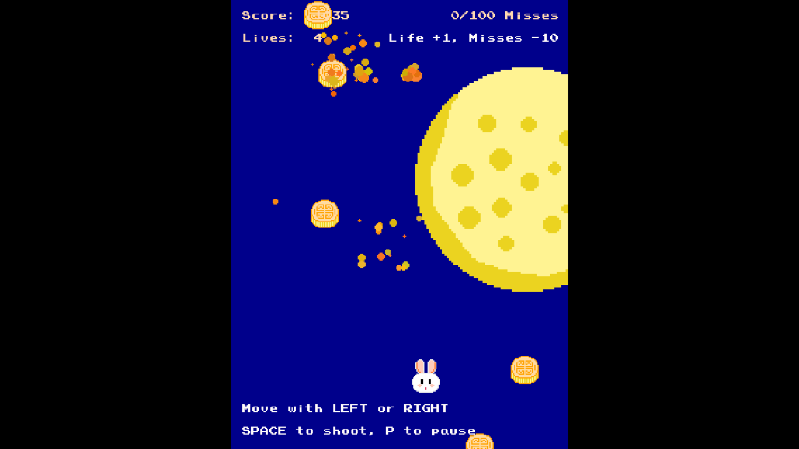

# Mid-Autumn Shooting Game Built with `vbPixelGameEngine`



## Description
This project is a nostalgic arcade-style shooter built with `vbPixelGameEngine`, centered on the Mid-Autumn Festival. Control a cute rabbit to shoot down mooncake enemies against a gently swaying moon backdrop.

The whole game features intuitive controls, progressive difficulty, and casual gameplay suitable for all ages. May this little game bring you a moment of fun, and perhaps a nudge to reach out to your loved ones, whether it's sharing a mooncake, a chat, or just letting them know you care.

Developed and launched during this year's Mid-Autumn Festival, this project is being uploaded now amid the Christmas season. As someone born and raised in China, I've leaned into the Mid-Autumn Festival's core spirit of family reunion - a value that resonates deeply, much like Christmas' focus on loved ones gathering.

All in-game visuals are hand-drawn by myself using Aseprite, while the bullets were originally intended to be stars, the size constaint of 10x10 pixels made this impractical, so I redesigned them as pink bows instead. Last but not least, the game features background music "Butari no Kimochi" (evoking cozy togetherness) and carefully selected sound effects from HaxeFlixel game templates, enhancing the warm, festive vibe.

## Installation
1. Clone (or download) the source code, and then navigate to your directory:
   ```bash
   git clone https://github.com/Pac-Dessert1436/Mid-Autumn-Shooting-Game
   cd Mid-Autumn-Shooting-Game
   ```
2. Restore dependencies:
   ```bash
   dotnet restore
   ```
3. Run (launches fullscreen at 300x400 resolution):
   ```bash
   dotnet run
   # or: msbuild "Mid-Autumn Shooting Game.sln"
   ```

## Gameplay
### Core Rules
- Control a rabbit (bottom of screen) to shoot incoming mooncakes.
- Survive by avoiding collisions and keeping escaped mooncakes under 100.
- Earn points to unlock bonus lives.
- Difficulty increases over time (spawn interval shortens from 1.0s to 0.3s).
- Game ends if lives run out (too many collisions) or 100+ mooncakes escape.

### Controls
| Action                  | Input                 |
|-------------------------|-----------------------|
| Move Left/Right         | Arrow Keys            |
| Shoot                   | Spacebar              |
| Pause/Resume            | **P** Key             |
| Restart (Game Over)     | **R** Key             |
| Exit                    | **ESC** Key           |
| Start (Title Screen)    | **Enter** Key         |

### Scoring
- For each mooncake shot down: 10-15 points.
- Bonus life (and -10 missed count) at every 1000 points (1000, 2000, etc.).

## Personal Notes
I created this game amid this year's Mid-Autumn Festival, driven by a simple yet heartfelt wish: *__to turn the "family reunion" we often write about in English essays into a tangible, warm reality, rather than a distant fantasy.__*

Like many young people in my community, I once struggled to get along with my parents during my college years, carrying unspoken misunderstandings. It wasn't until recent months that I truly cherished our time together. I've noticed countless others sharing similar frustrations online about strained relationships with their families, and that's what inspired this game.

The Mid-Autumn Festival is inherently about reunion, warmth, and appreciating the people we love. Through the cozy moon background, familiar mooncake motifs, and the nostalgic background music "Butari no Kimochi" (capturing the quiet joy of being together), I wanted to craft a gentle reminder: *__family bonds aren't perfect, but they're worth nurturing.__*

## Credits
- Audio: "Butari no Kimochi" (BGM); HaxeFlixel templates (SFX).
- Framework: [vbPixelGameEngine](https://github.com/DualBrain/vbPixelGameEngine).
- Art & Visuals: Hand-drawn in Aseprite

## License
The project is licensed under the MIT License. See the [LICENSE](LICENSE) file for details.